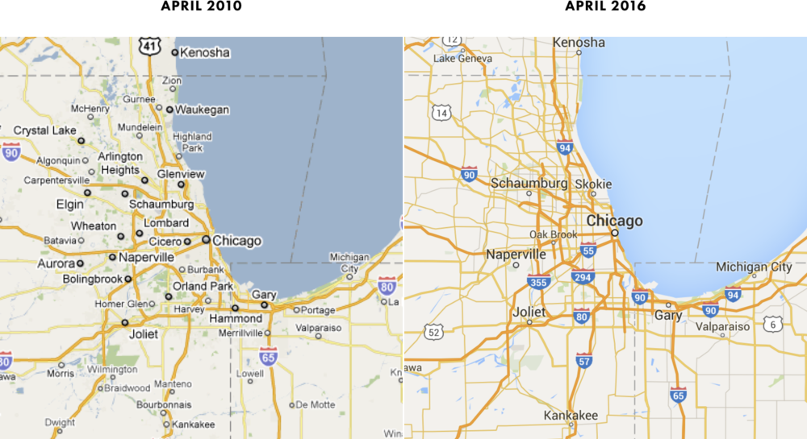
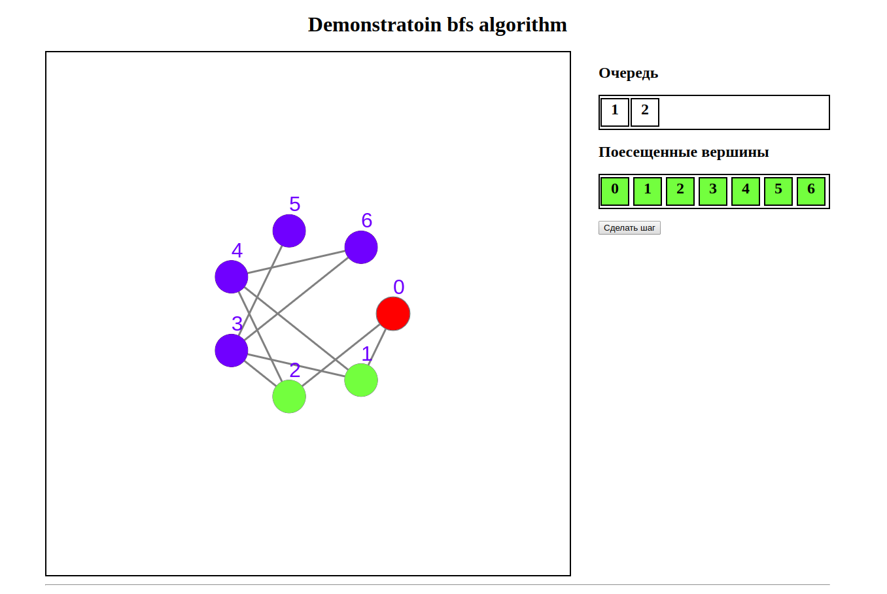
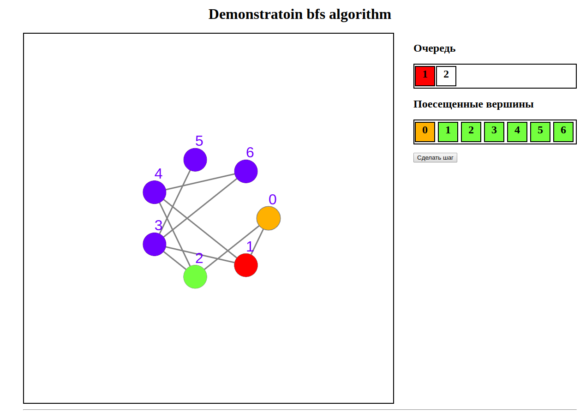
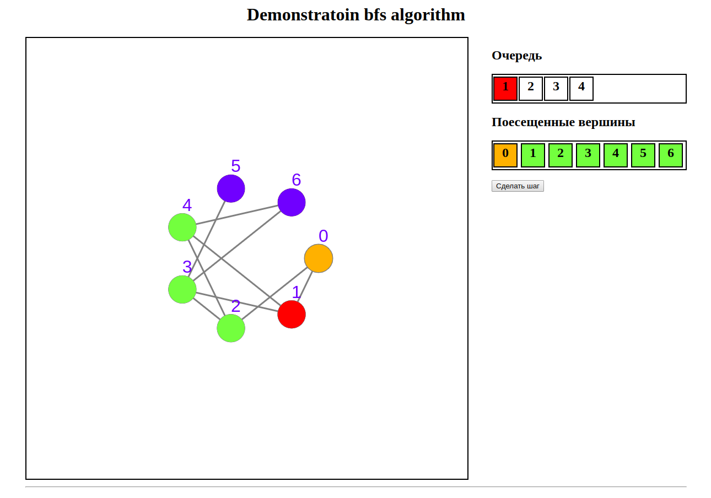
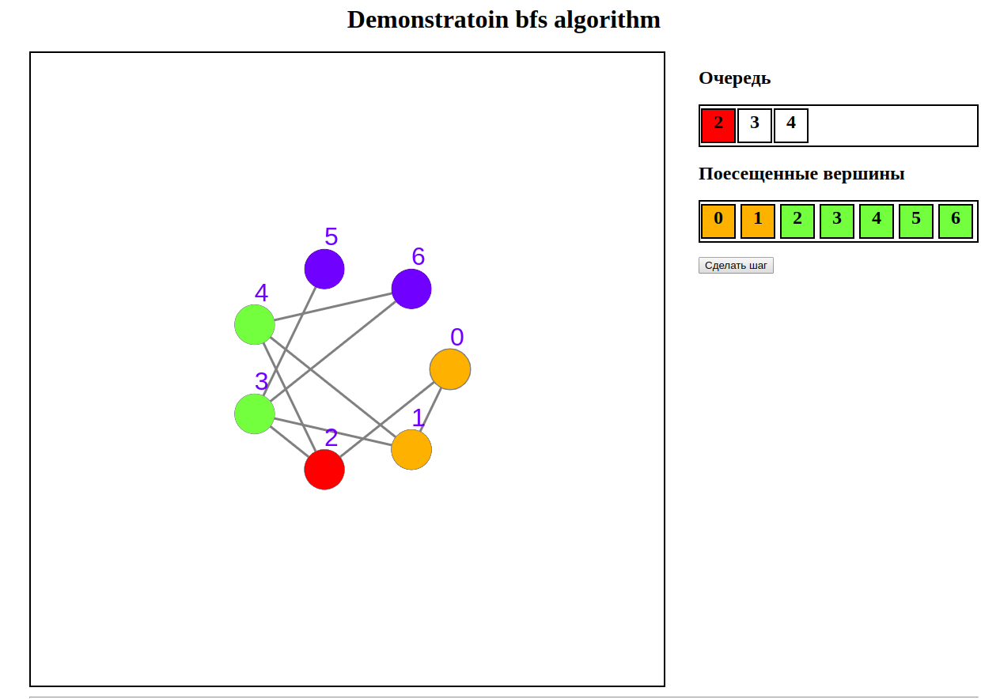

# Графы и их алгоритмы

Для начала определимся, что же такое граф. **Граф** - это некоторая абстрактная структура, состоящая из вершин и ребер соединяющих их.

## Задачи на графы

Графы, для чего они вообще нужны? А какие задачи могут решать? Много для чего! Ниже приведем краткий список задач решаемых при помощи графов.

1. Нахождение **кратчайшего пути между точками (PtP)** - данный вид задач решается при условии если задана длина ребер (если длина не задана, то длина ребер одинакова);
2. **Связанность** - поиск количества компонент связности;
3. Проверка графа на наличие циклов;
4. Проверка на то, является ли граф деревом.

Однако это более математический подход к графам, но нас больше интересует практика. Программирование - это о практике, а не о голой теории.

## Практическое применение графов

**Многие из задачь на графы имеют практическую интерпретацию.** Очевидно, что задача по нахождению оптимального пути между двум точками, очень часто может встречаться в логистических компаниях. Или приведем более приближенный к IT пример - прокладка сети. В данном случае офис можно разбить на некоторые ключевые точки "вершины графов", а расстояния между этими вершинами будет являться ребрами. Самое интересное то, что **алгоритмы основанный на грфах** используются при создании навигационных систем, таких как google-карты, 2gis и т.д.

**Одним из частных случаев графов являюются деревья.** Они имеют просто широченное применение в программировании. Файловая структура любой ОС - это деревья. Для быстрого поиска и структурированного хранения данных в программировании также могут использоваться различные разновидности деревьев. Такие как: двоичные деревья поиска, или красно черные деревья.

И даже моя программа по решению секвенция, тоже использует деревья, для разбиения секвенций на составляющие. Более подробно алгоритмы по разложению формул на составляющие были описаны учебном пособии по дискретной математике.

Файловая структура UNIX

> С деревьями связан один очень интересный аспект. Уровень понимания темы деревьев и способность с ними работать невероятно сильно коррелирует с уровнем разработчика. Если разработчику легко работать с деревьями, то, как правило, он довольно хорошо разбирается в коде, в том числе чужом, если нет, то и, в целом, у него больше сложностей с написанием и анализом кода. **цитата с Hexlet**

## BFS (breadth-first search) алгоритм поиска в ширину

Рассмотрим один из стандартных алгоритмов обхода графа - обход в ширину.
Для реализации алгоритма понадобятся следующие вещи:

1. **Очередь (queue)** посещаемых вершин. Очередь - это структура данных, которая работает по принципу **FIFO**, кто первый вошел, тот первый и вышел. Прямо как на кассе в супермаркете;
2. Дополнительный массив, в котом будем помечать вершины, в которых мы уже успели побывает;
3. Интерес к программированию и желание узнавать новое.

Теперь перейдем к демонстрации самого алгоритма.

1. Выбираем стартовую вершину.

2. Смотрим смежные ей вершины, если эти вершины не посещены, то добавляем их в очередь.

3. Далее выбираем первую вершину в очереди и смотрим на вершины смежные ей. Если эти вершины не являются посещенными, то добавляем их в очередь.

4. Далее удаляем из очереди текущую вершину. А активной "выбранной" вершиной становится следующая вершина в очереди.

5. И т.д. до достижения нужного результата.

Точкой выхода из данного алгоритма может быть достижение нужной вершины, обход всех точек графа или компоненты связанности.

Посмотреть на проиллюстрированную программу можно по этой [ссылке](https://kovarniy.github.io// "Необязательная подсказка"). А исходники программы можно посмотреть на моем [github](https://github.com/Kovarniy/kovarniy.github.io)

В заключение продемонстрирую свой вариант реализации алгоритма. Код программы написан с использованием языка C++.

      // This program is initialized by an undirected graph. This schedule is not weighted.
      // Example input
      /*
      4
      0 1 1 0
      1 0 1 1
      1 1 0 0
      0 1 0 0
      */

      #include <iostream>
      #include <string>
      #include <vector>
      #include <deque>

      using namespace std;

      vector<vector<int>> adjMtrix;
      vector<vector<int>> adjList;
      vector<bool> visitedVertex;
      deque<int> que;

      // breadth-first search aka bfs
      void bfs(int vertNum) {
         cout << "current vertex: " << vertNum << endl;
         visitedVertex[vertNum] = true;
         for(auto iter : adjList[vertNum])
            if(visitedVertex[iter] == false) {
                  que.push_back(iter);
                  visitedVertex[iter] = true;
            }

         if(!que.empty()){
            // retrieve the first element
            int nextVertex = que.front();
            que.pop_front();
            bfs(nextVertex);
         }

      }

      void printMatrix(vector<vector<int>> matrix) {
         for (int i = 0; i < matrix.size(); i++, cout << endl)
            for (int j = 0; j < matrix[i].size(); j++)
                  cout << matrix[i][j];
      }

      int main()
      {
      int graphSize;
      cin >> graphSize;
      adjMtrix.resize(graphSize, vector<int>(graphSize));
      adjList.resize(graphSize, vector<int>(0));
      visitedVertex.resize(graphSize, false);

      // adjacency matrix initialization
      for (int i = 0; i < graphSize; i++)
         for (int j = 0; j < graphSize; j++)
            cin >> adjMtrix[i][j];
      // printMatrix(adjMtrix);

      // turning a matrix into a list
      for (int i = 0; i < graphSize; i++)
         for (int j = i+1; j < graphSize; j++)
            if (adjMtrix[i][j] == 1) {
                  adjList[i].push_back(j);
                  adjList[j].push_back(i);
            }
      // printMatrix(adjList);
      bfs(0);

      }

Более интересную реализацию работы с графами можно посмотреть [здесь](https://github.com/Kovarniy/graph-algorithms/blob/master/graph-algorithms/graph-algorithms.cpp)

## Рекомендуемые ресурсы

1. https://www.youtube.com/watch?v=toncKklRq_0 - лекция
   Computer Science Center на тему обхода графов в ширину и глубину.
2. https://stepik.org/course/126/syllabus - курс основ теории графов
3. https://play.google.com/store/apps/details?id=wiki.algorithm.algorithms&hl=ru - приложение в котором демонстрируются алгоритмы

© Евгений Щемелинин. ФГБОУ ВО “ИГУ”.
